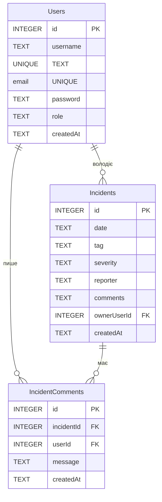

# Документація та інструкція для Backend API (Лабораторна робота №5 - Безпека та Захист від вразливостей)

Цей проект є бекенд-частиною для трекера інцидентів кібербезпеки з реляційною базою даних **SQLite** за допомогою сирих SQL-запитів, автоматичними міграціями на старті застосунку, зв'язками між сутностями (JOIN), аналітичними агрегаціями та впровадженим захистом від SQL Injection, IDOR, XSS та Security Misconfigurations.

У цій лабораторній роботі додано **захист від вразливостей**, **безпекові заголовки Express**, **маскування помилок SQLite** та **авторизацію користувача X-Demo-UserId**.

Проект повністю написано на **TypeScript**.

---

## Схема бази даних (Relational Schema)

База даних зберігається локально у файлі `./data/app.db` (ігнорується у Git).

Схема містить 3 взаємопов'язані таблиці:



### Деталі таблиць та обмежень (Constraints)

1. **Користувачі (`Users`)**:
   - `id`: Первинний ключ (`INTEGER PRIMARY KEY AUTOINCREMENT`).
   - `username`: Унікальне ім'я користувача (`TEXT NOT NULL UNIQUE`).
   - `email`: Унікальна електронна пошта (`TEXT NOT NULL UNIQUE`).
   - `password`: Хеш/пароль (`TEXT NOT NULL`).
   - `role`: Роль користувача (`TEXT NOT NULL CHECK(role IN ('Admin', 'User', 'Editor'))`).
   - `createdAt`: Дата реєстрації у форматі ISO (`TEXT NOT NULL`).

2. **Інциденти (`Incidents`)**:
   - `id`: Первинний ключ (`INTEGER PRIMARY KEY AUTOINCREMENT`).
   - `date`: Дата та час події (`TEXT NOT NULL`).
   - `tag`: Тип події (`TEXT NOT NULL CHECK(tag IN ('DDoS', 'Фішинг', 'Вредоносне ПО', 'Несанкціонований доступ', 'Інше'))`).
   - `severity`: Рівень загрози (`TEXT NOT NULL CHECK(severity IN ('Низький', 'Середній', 'Високий', 'Критичний'))`).
   - `reporter`: Хто повідомив про подію (`TEXT NOT NULL`).
   - `comments`: Опис детальних обставин (`TEXT` - необов'язкове).
   - `ownerUserId`: Зовнішній ключ (`INTEGER NOT NULL`), посилається на `Users.id`. Вказує на власника інциденту для перевірки доступу (захист від IDOR).
   - `createdAt`: ISO рядок створення (`TEXT NOT NULL`).

3. **Коментарі (`IncidentComments`)**:
   - `id`: Первинний ключ (`INTEGER PRIMARY KEY AUTOINCREMENT`).
   - `incidentId`: Зовнішній ключ (`INTEGER NOT NULL`), посилається на `Incidents.id`. При видаленні інциденту його коментарі автоматично видаляються (`ON DELETE CASCADE`).
   - `userId`: Зовнішній ключ (`INTEGER NOT NULL`), посилається на `Users.id`. Видалення користувача заблоковано, якщо він має коментарі (`ON DELETE RESTRICT`).
   - `message`: Вміст коментаря (`TEXT NOT NULL`).
   - `createdAt`: ISO рядок створення (`TEXT NOT NULL`).

### Створені індекси (Indexes)
Для оптимізації вибірок додано індекси:
- `idx_incidents_tag` на `Incidents(tag)` — прискорює фільтрацію за типом інциденту.
- `idx_incidents_severity` на `Incidents(severity)` — прискорює фільтрацію за рівнем загрози.
- `idx_comments_incidentId` на `IncidentComments(incidentId)` — прискорює з'єднання таблиць (JOIN) при отриманні коментарів до інциденту.

---

## Як запустити проект локально

Усі команди запускаються з папки `backend`:

1. **Встановлення залежностей**:
   ```bash
   npm install
   ```

2. **Ініціалізація та наповнення бази даних (Seeding)**:
   Для автоматичного створення таблиць та наповнення бази тестовими даними (користувачі, інциденти, коментарі) запустіть скрипт:
   ```bash
   npx tsx src/db/seed.ts
   ```

3. **Запуск у режимі розробки** (автоматично виконує міграції перед стартом):
   ```bash
   npm run dev
   ```

4. **Компіляція проекту**:
   ```bash
   npm run build
   ```

5. **Запуск скомпільованої версії**:
   ```bash
   npm start
   ```

---

## Додаткові REST-можливості (Рівень "На Відмінно")

### 1. Фільтрація, сортування та пагінація
Всі ці механізми перенесені на рівень бази даних за допомогою побудови динамічних `SELECT`-запитів (`WHERE`, `ORDER BY`, `LIMIT`, `OFFSET`).

Приклад запиту з фільтрацією за рівнем:
```bash
curl -i "http://localhost:3000/api/v1/incidents?severity=Високий"
```

### 2. Отримання пов'язаних коментарів (Ендпоінт із `JOIN`)
Повертає список коментарів до конкретного інциденту з приєднанням імені та пошти авторів через зв'язок `JOIN Users`:
```bash
curl -i http://localhost:3000/api/v1/incidents/1/comments
```

### 3. Додавання коментаря
Дозволяє додати новий коментар до інциденту від імені конкретного користувача:
```bash
curl -i -X POST http://localhost:3000/api/v1/incidents/1/comments \
  -H "Content-Type: application/json" \
  -d '{"userId": 3, "message": "Підтверджую блокування хостів зловмисника"}'
```

### 4. Аналітичне резюме (Ендпоінт з `COUNT` та `GROUP BY`)
Повертає агреговані статистичні дані про загальну кількість інцидентів та розподіл їх за severity і tag:
```bash
curl -i http://localhost:3000/api/v1/incidents/analytics/summary
```

---

## Інструкція та демонстрація захисту від SQL Injection

Раніше пошуковий ендпоінт був вразливим: `GET /api/v1/incidents/search-vulnerable?q=...`.

### Було (Вразливий код):
Код репозиторію формував запит за допомогою безпосередньої конкатенації:
```typescript
const sql = `SELECT * FROM Incidents WHERE comments LIKE '%${q}%' ORDER BY id DESC;`;
const rows = await all<any>(sql);
```
Експлуатація:
```bash
curl -i "http://localhost:3000/api/v1/incidents/search-vulnerable?q=%27%20OR%201=1%20--"
```
Повертало абсолютно всі інциденти через зсув логіки запиту.

### Стало (Захищений код):
Тепер запит виконується через безпечний плейсхолдер:
```typescript
const sql = "SELECT * FROM Incidents WHERE comments LIKE ? ORDER BY id DESC;";
const rows = await all<any>(sql, [`%${q}%`]);
```
Спроба експлуатації повертає пустий масив `[]` (0 записів), оскільки запит шукає підрядок `'% OR 1=1 --` буквально, запобігаючи виконанню довільного SQL-коду.

---

## Захист від IDOR та Авторизація (`X-Demo-UserId`)

Для створення, редагування та видалення інцидентів обов'язково потрібно передавати заголовок `X-Demo-UserId`, який ідентифікує поточного користувача. Редагувати та видаляти інциденти може лише їх безпосередній власник (`ownerUserId`).

### Приклад блокування IDOR (Користувач 2 намагається змінити інцидент Користувача 1):
```bash
curl -i -X PATCH http://localhost:3000/api/v1/incidents/1 \
  -H "Content-Type: application/json" \
  -H "X-Demo-UserId: 2" \
  -d '{"comments": "Спроба зламати інцидент"}'
```
**Відповідь:** `HTTP/1.1 403 Forbidden`
```json
{
  "error": {
    "code": "FORBIDDEN",
    "message": "Доступ заблоковано: Ви не є власником цього інциденту"
  }
}
```

---

## Приклади запитів для перевірки (Users & Incidents CRUD)

### Робота з користувачами (Users API):

* **Отримати всіх користувачів:**
  ```bash
  curl -i http://localhost:3000/api/v1/users
  ```
* **Отримати користувача за ID:**
  ```bash
  curl -i http://localhost:3000/api/v1/users/1
  ```
* **Створити нового користувача:**
  ```bash
  curl -i -X POST http://localhost:3000/api/v1/users \
    -H "Content-Type: application/json" \
    -d '{"username": "ivan_cyber", "email": "ivan@knu.ua", "password": "secure123", "role": "User"}'
  ```
* **Частково оновити користувача:**
  ```bash
  curl -i -X PATCH http://localhost:3000/api/v1/users/2 \
    -H "Content-Type: application/json" \
    -d '{"role": "Admin"}'
  ```
* **Видалити користувача:**
  ```bash
  curl -i -X DELETE http://localhost:3000/api/v1/users/3
  ```

### Робота з інцидентами (Incidents API):

* **Отримати всі інциденти:**
  ```bash
  curl -i http://localhost:3000/api/v1/incidents
  ```
* **Створити новий інцидент (від імені користувача з ID 1):**
  ```bash
  curl -i -X POST http://localhost:3000/api/v1/incidents \
    -H "Content-Type: application/json" \
    -H "X-Demo-UserId: 1" \
    -d '{"date": "2026-06-04T12:00", "tag": "Вредоносне ПО", "severity": "Критичний", "reporter": "Ivan Ivanov", "comments": "Виявлено шифрувальник на робочому компютері."}'
  ```
* **Оновити власний інцидент (якщо ID власника відповідає):**
  ```bash
  curl -i -X PATCH http://localhost:3000/api/v1/incidents/1 \
    -H "Content-Type: application/json" \
    -H "X-Demo-UserId: 1" \
    -d '{"comments": "Оновлені деталі: DDoS-атака припинилась."}'
  ```
* **Видалити власний інцидент:**
  ```bash
  curl -i -X DELETE http://localhost:3000/api/v1/incidents/1 \
    -H "X-Demo-UserId: 1"
  ```
